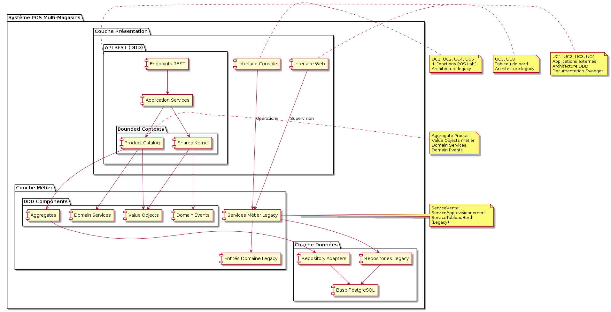
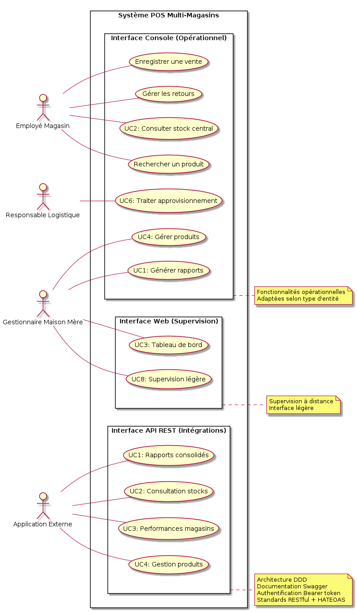

# Architecture du Système Multi-Magasins - Modèle 4+1

## Vue Logique

La vue logique représente les classes principales et leurs relations dans l'architecture multi-magasins.

### Diagramme de classes

### Évolution du modèle (Lab 1 → Lab 2 → Lab 3)

**Nouvelles entités :**
- **Magasin** : Représente un magasin de l'entreprise
- **CentreLogistique** : Gestion centralisée des stocks
- **MaisonMere** : Entité administrative centrale
- **DemandeApprovisionnement** : Demandes de réapprovisionnement
- **Rapport** : Rapports consolidés générés

**Entités étendues :**
- **Produit** : Ajout de seuils d'alerte et gestion multi-magasins
- **Stock** : Gestion par magasin et centre logistique
- **Vente** : Association avec un magasin spécifique

### Services métier étendus

**Services existants (réutilisés) :**
- **ServiceProduit** : Recherche de produits (étendu multi-magasins)
- **ServiceVente** : Gestion des ventes par magasin
- **ServiceInventaire** : Gestion des stocks multi-entités
- **ServiceTransaction** : Transactions distribuées

**Nouveaux services :**
- **ServiceApprovisionnement** : Gestion des demandes et transferts
- **ServiceTableauBord** : Indicateurs de performance pour supervision web

### Architecture 3-interfaces

**Interface Console (Opérationnelle) :**
- Réutilisation des services métier du Lab 1
- Extension pour UC1 (rapports), UC2 (stock central), UC4 (produits), UC6 (approvisionnement)
- Adaptée selon le type d'entité (MAGASIN, CENTRE_LOGISTIQUE, MAISON_MERE)

**Interface Web (Supervision) :**
- Templates HTML minimalistes
- UC3 (tableau de bord) et UC8 (supervision légère)
- Aucune fonctionnalité opérationnelle

**Interface API REST (Intégrations) :**
- Flask-RESTX avec documentation Swagger automatique
- Architecture Domain-Driven pour organisation métier structurée
- UC1-UC4 exposés via endpoints RESTful
- Authentification Bearer token et CORS configuré
- Standards REST avec HATEOAS et pagination

## Vue des processus

### Diagrammes de séquence

#### UC1 - Génération de rapport consolidé (Console)

#### UC3 - Tableau de bord supervision (Web)

#### Processus de vente multi-magasins

### Processus principaux

1. **Processus de vente en magasin** (hérité du Lab 1)
2. **Processus de génération de rapports** (console maison mère + API REST)
3. **Processus de demande et validation d'approvisionnement** (console)
4. **Processus de supervision via tableau de bord** (web)
5. **Processus d'intégration externe via API** (applications tierces)

### Nouveaux flux API REST

- **Consultation asynchrone des stocks** via `GET /api/v1/stocks`
- **Génération de rapports programmée** via `POST /api/v1/reports/sales/consolidated`
- **Synchronisation des produits** via `PUT/DELETE /api/v1/products/{id}`
- **Monitoring des performances** via `GET /api/v1/stores/performances`

## Vue de déploiement

La vue de déploiement montre l'architecture 3-tier distribuée pour le système multi-magasins.

### Architecture 3-tier distribuée

**Tier 1 - Base de données (Persistance) :**
- PostgreSQL centralisé pour toutes les entités
- Gestion des données consolidées
- Transactions distribuées ACID
- **Index de performance** pour optimiser les requêtes fréquentes

**Tier 2 - Services métier (Logique) :**
- Services métier centralisés
- API de synchronisation entre entités
- Gestion des règles métier multi-magasins
- **Logging centralisé** pour traçabilité et débogage

**Tier 3 - Présentation :**
- **Interface console** : Fonctionnalités opérationnelles (UC1, UC2, UC4, UC6 + POS Lab1)
- **Interface web** : Supervision légère uniquement (UC3, UC8)
- **API REST** : Intégrations externes (UC1-UC4 via endpoints RESTful)

### Entités déployées

**API REST Server :**
- Flask-RESTX sur port 8000
- Documentation Swagger UI accessible via `/api/docs`
- Authentification Bearer token
- CORS configuré pour localhost:3000,5000
- Bounded contexts pour organisation métier structurée

**Magasins (5 instances) :**
- Interface console pour ventes (Lab 1) + consultation stock central (UC2)
- Connexion aux services centralisés

**Centre logistique :**
- Interface console pour traitement des demandes d'approvisionnement (UC6)

**Maison mère :**
- Interface console pour génération de rapports (UC1) et gestion produits (UC4)
- Interface web pour supervision (UC3, UC8)

### Optimisations de performance

**Index de base de données (optimisés) :**
- **Index composite ventes** : `idx_vente_entite_date` pour les rapports consolidés (requête critique)
- **Index composite stocks** : `idx_stock_entite_produit` pour la consultation des stocks par entité
- **Index recherche produits** : `idx_produit_nom` pour la recherche de produits par nom
- **Index demandes** : `idx_demande_statut` pour filtrer les demandes d'approvisionnement

**Stratégies de cache :**
- Cache des indicateurs de performance (rafraîchissement périodique)
- Cache des données de référence (produits, entités)
- Cache API pour réduire la charge sur les services métier

## Vue d'implémentation

La vue d'implémentation montre l'organisation du code avec l'architecture MVC.

### Organisation des modules

**Couche Domaine (Model - réutilisée) :**
- `src/domain/entities.py` : Entités métier étendues
- `src/domain/services.py` : Services métier étendus avec logging

**Couche Persistance (réutilisée et étendue) :**
- `src/persistence/models.py` : Modèles SQLAlchemy étendus avec index
- `src/persistence/repositories.py` : Repositories étendus

**Couche Présentation Console (étendue) :**
- `src/client/console.py` : Interface console adaptée par type d'entité
- Fonctionnalités opérationnelles complètes (UC1, UC2, UC4, UC6)

**Couche Web Supervision :**
- `src/web/app.py` : Application Flask minimaliste (4 routes)
- `src/web/templates/` : Templates HTML légers (index.html, dashboard.html)

**Couche API REST :**
- `src/api/app.py` : Application Flask-RESTX avec configuration Swagger
- `src/api/endpoints/` : Endpoints REST organisés par domaine
- `src/api/bounded_contexts/` : Architecture Domain-Driven pour l'API
  - `product_catalog/` : Bounded context avec Aggregates, Value Objects et Domain Services
  - `shared/` : Value Objects et Domain Events partagés
- `src/api/models.py` : Modèles de documentation Swagger/OpenAPI
- `src/api/auth.py` : Système d'authentification Bearer token
- `src/api/error_handlers.py` : Gestion standardisée des erreurs

### Qualité et observabilité

**Tests :**
- Tests unitaires pour les nouveaux services (`tests/test_services.py`)
- Tests automatisés API REST (`tests/test_api_rest.py`)
- Tests d'intégration pour les workflows multi-magasins
- Tests de performance pour les requêtes critiques

**Logging :**
- Logs applicatifs dans `logs/pos_multimagasins.log`
- Logs des services métier dans `logs/services.log`
- Logs API REST dans `logs/pos_api.log`
- Rotation automatique des fichiers de logs
- Niveaux de log configurables (INFO, WARNING, ERROR)

**Métriques :**
- Métriques de performance des services
- Métriques API REST (temps de réponse, codes d'erreur)
- Indicateurs de santé du système
- Alertes automatiques pour les situations critiques

## Vue des cas d'utilisation

La vue des cas d'utilisation décrit les scénarios du système multi-magasins.

### Cas d'utilisation principaux

### Acteurs et cas d'utilisation

**Employé Magasin :**
- Effectuer une vente (hérité Lab 1) - Console
- Consulter stock central (UC2) - Console

**Responsable Logistique :**
- Traiter demandes d'approvisionnement (UC6) - Console

**Gestionnaire Maison Mère :**
- Générer rapports consolidés (UC1) - Console
- Gérer produits (UC4) - Console
- Consulter tableau de bord (UC3) - Web
- Supervision légère (UC8) - Web

**Application Externe :**
- Consulter rapports consolidés (UC1) - API REST
- Consulter stocks par magasin (UC2) - API REST
- Monitorer performances magasins (UC3) - API REST
- Gérer produits programmatiquement (UC4) - API REST

**Système :**
- Maintenir cohérence des données
- Calcul des indicateurs de performance

### Évolution des cas d'utilisation

**Maintenus du Lab 1 :**
- Rechercher un produit
- Enregistrer une vente
- Gérer les retours
- Consulter le stock local

**Maintenus du Lab 2 :**
- UC1, UC2, UC4, UC6 : Fonctionnalités opérationnelles (console)
- UC3, UC8 : Supervision légère (web)
- Gestion multi-magasins
- Séparation claire des responsabilités interfaces

**Extension Lab 3 :**
- UC1-UC4 : Exposition via API REST pour intégrations externes
- Documentation interactive Swagger
- Authentification sécurisée pour applications tierces
- Standards RESTful avec pagination et HATEOAS

## Philosophie architecturale

### Séparation des responsabilités

**Interface Console - Opérationnelle :**
- **Responsabilité** : Toutes les fonctionnalités métier et opérationnelles
- **Utilisateurs** : Employés, responsables, gestionnaires dans leurs tâches quotidiennes
- **Fonctions** : UC1 (rapports), UC2 (stock central), UC4 (produits), UC6 (approvisionnement) + Lab1
- **Avantages** : Interface riche, adaptée à chaque type d'entité, performance optimale

**Interface Web - Supervision :**
- **Responsabilité** : Supervision légère et accès distant
- **Utilisateurs** : Gestionnaires pour supervision rapide
- **Fonctions** : UC3 (tableau de bord), UC8 (interface légère)
- **Avantages** : Accès distant, visualisation simple, maintenance réduite

**Interface API REST - Intégrations :**
- **Responsabilité** : Intégrations externes et accès programmatique
- **Utilisateurs** : Applications tierces, systèmes ERP, applications mobiles
- **Fonctions** : UC1-UC4 via endpoints RESTful standardisés
- **Avantages** : Standards REST, documentation automatique, authentification sécurisée

### Principe de complémentarité

Les trois interfaces sont **complémentaires** et non concurrentes :
- **Console** : Interface principale pour les opérations quotidiennes
- **Web** : Accès rapide pour supervision à distance
- **API REST** : Pont vers l'écosystème externe sans perturbation interne

## Aspects non-fonctionnels

### Performance

**Optimisations base de données :**
- Index composites pour les requêtes multi-critères
- Requêtes optimisées pour les rapports consolidés
- Pagination pour les grandes listes

**Optimisations applicatives :**
- Cache des données fréquemment consultées
- Traitement asynchrone pour les rapports volumineux
- Compression des réponses HTTP

### Observabilité

**Logging structuré :**
- Logs au format standardisé avec contexte
- Corrélation des logs entre services
- Logs API REST séparés pour analyse
- Niveaux de log appropriés selon l'environnement

**Métriques métier :**
- Nombre de ventes par magasin
- Temps de réponse des services critiques
- Métriques API REST (appels, codes d'erreur)
- Indicateurs de performance du tableau de bord

**Monitoring :**
- Santé des services métier
- Performance des requêtes base de données
- Disponibilité interfaces console, web et API REST
- Health check API : `/api/health`

### Maintenabilité

**Tests automatisés :**
- Couverture des services critiques
- Tests d'intégration pour les workflows
- Tests de régression pour les évolutions

**Documentation :**
- Documentation technique à jour
- Documentation API interactive (Swagger UI)
- Guides d'utilisation pour les interfaces
- Procédures de déploiement et maintenance