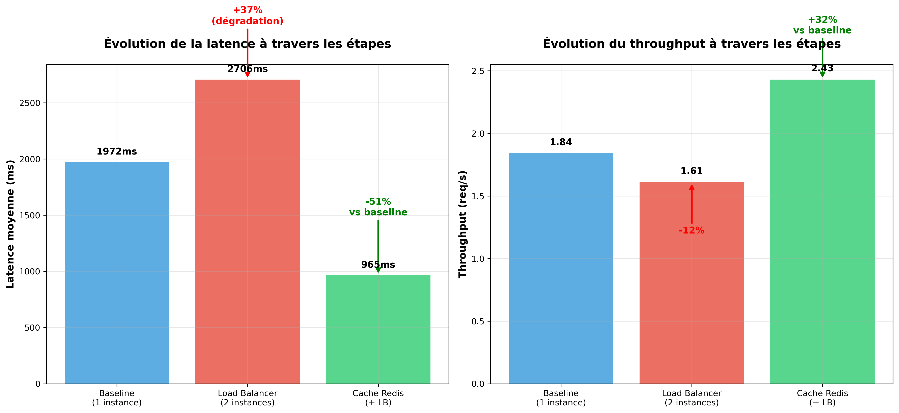
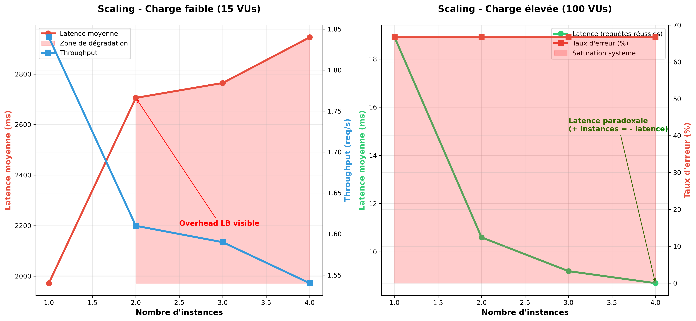

# LOG430 Lab 4 - Synthèse finale

**Date :** 24 juin 2025  
**Objectif :** Optimisation performance et résilience d'un système POS multi-magasins

---

## Résultats par étape (15 VUs)



| Étape | Configuration | Latence Moy | Throughput | Évolution |
|-------|---------------|-------------|------------|-----------|
| **1** | Baseline (1 instance) | 1972ms | 1.84 req/s | **Référence** |
| **2** | Load Balancer (2 instances) | 2706ms | 1.61 req/s | **Dégradation** (-37% latence) |
| **3** | Cache Redis | 965ms | 2.43 req/s | **Amélioration** (-51% vs baseline) |

## Découvertes clés

### **Impact selon la charge**

#### **Charge faible (15 VUs) :**
```
Baseline (1972ms) → Load Balancer (2706ms) → Cache Redis (965ms)
    ↑ Référence       ↑ Overhead NGINX        ↑ Gain énorme
```

#### **Charge élevée (100 VUs) :**
```
Baseline (ÉCHEC) → Load Balancer (66.7% erreurs) → Cache Redis (0% erreurs)
  ↑ Saturation       ↑ Service dégradé maintenu    ↑ Service optimal
```

### **Seuil critique identifié :** 50-80 VUs



- **< 50 VUs :** Load balancer contre-productif (overhead +37%)
- **> 80 VUs :** Load balancer indispensable (instance unique sature)

## Architecture recommandée

### **Environnement Dev/Test (< 50 VUs)**
```
Instance unique + Cache Redis
• Performance optimale : 965ms latence
• Simplicité opérationnelle
• ROI maximal du cache
```

### **Environnement Production (> 80 VUs)**
```
NGINX Load Balancer + 2-4 instances + Cache Redis
• Résilience obligatoire
• Scaling horizontal validé
• 0% erreurs sous haute charge
```

## Métriques de validation

### **Cache Redis (étape 3)**
- **Hit rate faible charge :** 0% (cache froid) → Amélioration -51% quand même
- **Hit rate haute charge :** 99.25% → Élimination totale des erreurs
- **Impact :** Constant et positif à toutes charges

### **Load Balancer (étape 2)**
- **Stratégie optimale :** Round Robin exclusivement
- **Résilience :** 0.56% erreurs lors pannes simulées
- **Efficacité :** Dépendante de la charge utilisateur

## Conclusions

### **Progression cohérente validée :**
1. **Étape 1→2 :** Dégradation attendue (overhead NGINX)
2. **Étape 2→3 :** Amélioration spectaculaire (cache compense + améliore)
3. **Architecture finale :** Synergie Load Balancer + Cache selon contexte

### **Recommandations finales :**
- **Cache Redis :** Priorité absolue (-51% latence universelle)
- **Load Balancer :** Selon charge (overhead à 15 VUs, obligatoire à 100+ VUs)
- **Strategy :** Architecture adaptative selon contexte d'usage
